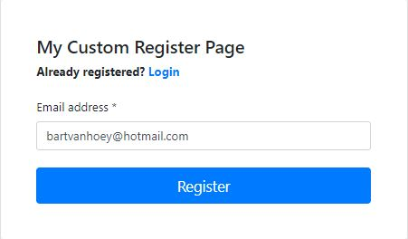

## Setup Facebook Registration and Email Confirmation on User Registration


## Introduction

In this article, I will show you first how to set up **Facebook registration** in an **ABP Framework** application. Thereafter howto get a user who registered with **Facebook** verified by email.

The sample application has been developed with **Blazor** as UI framework and **SQL Server** as database provider.

The best way to follow along, is to start from scratch and start with the article [Setup Email Confirmation on User Registration](https://community.abp.io/articles/setup-email-confirmation-on-user-registration-q0vgxang) as it serves as the base for this article. Alternatively, you can clone the [repository](https://github.com/bartvanhoey/AbpUserVerificationByEmail) of the project.

```bash
git clone https://github.com/bartvanhoey/AbpUserVerificationByEmail.git
```

## Source Code

The source code of the completed application is [available on GitHub](https://github.com/bartvanhoey/AbpFacebookRegistration).

## Requirements

The following tools are needed to be able to run the solution.

* .NET 5.0 SDK
* VsCode, Visual Studio 2019 16.8.0+ or another compatible IDE

You also need a **Gmail** account to follow along.

## Set up Facebook registration

### Create the app in FACEBOOK for Developers

* Navigate to [FACEBOOK for Developers](https://developers.facebook.com/apps/) and sign in.
* Click on the **Create App** button.
* Choose **Build Connected Experiences** in the **Create an App** window. Continue.
* Fill in **App Display Name** and click on the **Create App** button.
* In the **Add Products to Your App** section, find **Facebook Login** and click **Set Up**.
* Goto the **Facebook Login Settings** and update the settings as in the image below. 
* Replace the port number with the port number on which the **SwaggerUI** gets served. You can also find it in file **launchsettings.json** of the **AbpFacebookRegistration.HttpApi.Host** project.
* Copy **App ID** and **App Secret** in the **Basic Settings** windows.


### Add the Facebook NuGet Package to HttpApi.Host project

* Open a command prompt in the **HttpApi.Host** project and run the command below:

```bash
dotnet add package Microsoft.AspNetCore.Authentication.Facebook
```

### Add an **Authentication** section to the **appsettings.json** file of the **HttpApi.Host** project

**WARNING**: Make sure you **don't publish** your **Credentials** to **GitHub** or **another Versioning System**.

```json
 "Authentication": {
    "Facebook": {
      "AppId" : "YourAppIdHere",
      "AppSecret": "YourAppSecretHere"
    }
```

### Configure the Provider in the HttpApiHostModule of the HttpApi.Host

Add the **AddFacebook** extension method to the **ConfigureAuthentication** method in the **HttpApiHostModule** of the **HttpApi.Host**

```csharp
    private void ConfigureAuthentication(ServiceConfigurationContext context, IConfiguration configuration)
    {
      //...  

      context.Services.AddAuthentication()
            .AddFacebook(facebook =>
            {
                facebook.AppId = configuration["Authentication:Facebook:AppId"];
                facebook.AppSecret = configuration["Authentication:Facebook:AppSecret"];
                facebook.Scope.Add("email");
                facebook.Scope.Add("public_profile");
            });
    }
```

## Open & Run the Application

* Run the `AbpFacebookRegistration.DbMigrator` application to apply the migrations and seed the initial data.
* Run the `AbpFacebookRegistration.HttpApi.Host` application to start the server side.
* Run the `AbpFacebookRegistration.Blazor` application to start the Blazor UI project.

When you navigate to the **login page** of your application, you already see the **Facebook** button. DO NOT CLICK THE FACEBOOK BUTTON YET! **Although Facebook Registration ALREADY works**, I would like to show you the Email Confirmation part too. :-)


## Gmail Credentials

### Setting up Google SMTP Server in appsettings.json

* Open file **EncryptGmailPasswordAppService.cs** in the **AbpFacebookRegistration.Application** project and **replace YourGmailPasswordHere** with your Gmail password.

* Run the **AbpFacebookRegistration.HttpApi.Host** project and navigate to the **SwaggerUI**.

* Find the **EncryptGmailPassword** method and click on **Try it out** first, **Execute** after.


* Copy the **encrypted Gmail password** in the response body.

* Open file **appsettings.json** in project **HttpApi.Host** and update the **Smtp Settings** with the correct values.
  
```json
"Settings": {
    "Abp.Mailing.Smtp.Host": "smtp.gmail.com",
    "Abp.Mailing.Smtp.Port": "587",
    "Abp.Mailing.Smtp.UserName": "your-gmail-email-address-here",
    "Abp.Mailing.Smtp.Password": "your-encrypted-gmail-password-here",
    "Abp.Mailing.Smtp.Domain": "",
    "Abp.Mailing.Smtp.EnableSsl": "true",
    "Abp.Mailing.Smtp.UseDefaultCredentials": "false",
    "Abp.Mailing.DefaultFromAddress": "your-gmail-email-address-here",
    "Abp.Mailing.DefaultFromDisplayName": "Your-Custom-Text-Here"
  }
  ```

## Pages/Account folder of the HttpApi.Host project

In the **Pages/Account** folder you find the files needed for the Email Confirmation after User Registration. I copied/pasted these files from the [Account Module](https://github.com/abpframework/abp/tree/dev/modules/account/src/Volo.Abp.Account.Web/Pages/Account) of the **ABP Framework** and adapted them to my needs. By doing so, you override the original files of the Account Module and you can hook in into the registration flow.

The heavy-lifting happens mainly in the **RegisterModel** file. When an unregistered user clicks on the **Facebook** button to login, the **OnPostAsync** method is gets executed.  The **RegisterExternalUserAsync** method to create the user is called next. At the end of the RegisterExternalUserAsync method an email is sent by the **SendEmailToAskForEmailConfirmationAsync** method.

## Test the Facebook Registration flow and User Email Verification

* Start both the **Blazor** and **HttpApi.Host** project to run the application.
* Navigate to the **Login** page and click on the **Facebook** button.
* You will see a **Facebook** screen that says your app will receive name, profile picture and email address.
* Next you will land on the **My Customer Register Page**.
  


* Click on the **Register** button to complete the **Facebook registration** (Email is sent in this step).
* Goto your email inbox and click on the [clicking here](https://localhost:44367/) link to confirm your account.
* Navigate to the **Login** page and click on the **Facebook** button.

Et voilà! This is the result. **The user's email address is successfully verified**!


You can now force a user who registered with Facebook to confirm his email address before he can use your application.

Click on the links to find more about [Sending Emails](https://docs.abp.io/en/abp/latest/Emailing) and the [Account Module](https://docs.abp.io/en/abp/latest/Modules/Account)

Get the [source code](https://github.com/bartvanhoey/AbpFacebookRegistration) on GitHub.

Enjoy and have fun!
